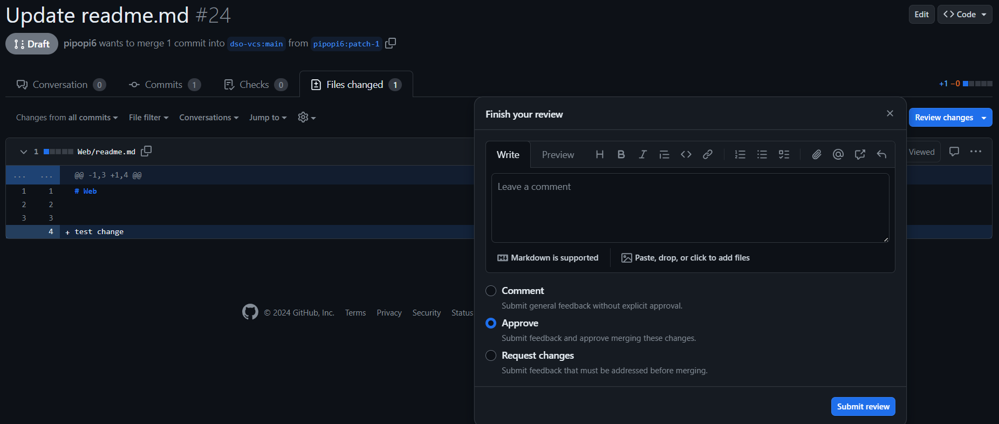

# SECURE CODING HANDBOOK

## Phân quyền

| Role | Truy cập repo | Chỉnh sửa repo | Tạo issue | Tạo pull request | Duyệt pull request | Cấu hình repo |
| --- | --- | --- | --- | --- | --- | --- |
| Admin | :heavy_check_mark: | :heavy_check_mark: | :heavy_check_mark: | :heavy_check_mark: | :heavy_check_mark: |  :heavy_check_mark: |
| Contributer | :heavy_check_mark: | :heavy_check_mark: | :heavy_check_mark: | :heavy_check_mark: | :heavy_check_mark: |  |
| User | :heavy_check_mark: |  | :heavy_check_mark: | :heavy_check_mark: |  |  |

- [Hướng dẫn sử dụng](#truy-cập-handbook)
- [Quy trình contribute](#quy-trình-contribute)

## Truy cập handbook

1. Người dùng thường truy cập vào handbook, lựa chọn nền tảng code muốn xem trong nhánh **main**
    
1. Lựa chọn ngôn ngữ và framework muốn xem
    
2. Sau khi chọn ngôn ngữ, trang web hiển thị danh sách các lỗ hổng theo từng chức năng. Người dùng bấm vào lỗ hổng trong chức năng cần xem
    
3. Nội dung bao gồm các ví dụ về uncompliance code và gợi ý compliance code
    

## Tạo issue

Người dùng có thể tạo issue refer trực tiếp tới vị trí bị lỗi

Mô tả vấn đề cần được giải quyết

Ngoài ra, có thể refer issue tới các issue khác, commit, pull request

## Tạo pull request

Người dùng thường fork repo và chỉnh sửa trên bản fork đó. 

Trong trường hợp người dùng muốn tạo 1 file lỗ hổng mới thì phải sử dụng [template vuln](Templates/Web/vuln.md) và cập nhật tên lỗ hổng vào file **readme** của folder đó. Tên file lỗ hổng không viết hoa để đồng nhất với repo.

Sau khi chỉnh sửa, commit change và tạo pull request tới repo chính

Chọn draft a pull request để contributer theo dõi và duyệt request

**Lưu ý trước khi thực hiện pull request, người dùng phải đảm bảo update repo tới phiên bản mới nhất để tránh xảy ra conflict khi merge request**

## Quy trình contribute

Admin hoặc Contributer kiểm tra pull request và assign 1 người khác để review pull request

Người được assign review pull request và đánh dấu đã review

**Nếu xuất hiện conflict ở bước này, yêu cầu người dùng update repo và tạo lại pull request.** 

Contributer thực hiện merge request sau các bước kiểm tra

